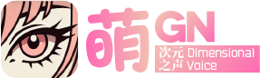
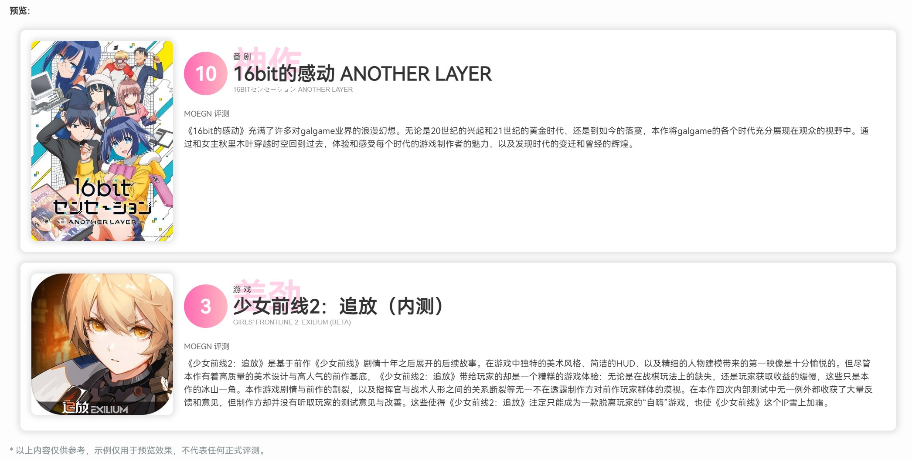

# MOEGN（萌GN）


A simple and cute(moe 萌) Hexo-Shoka theme scorecard-created plug-in.

**Coming Soon!**

MOEGN's style and functionality will be constantly updated before release! [Click here](https://blog.moeqy.com/laboratory/) to preview the latest status.



*\* The above content is for reference only, and the examples are only for preview effects and do not represent any formal review.* 

*\* The preview image shows content under development and is not the final version.*

# Thanks
 - [hexo-theme-shoka](https://github.com/amehime/hexo-theme-shoka)
 - [hexo-theme-shokaX](https://github.com/theme-shoka-x/hexo-theme-shokaX)

## 收藏文章背景媒体

`src/content/collections` 下的收藏文章可以通过 `heroMedia` 控制收藏主页全屏轮播的背景。图片和视频均支持站内 `/public` 路径或完整 URL；已有的收藏素材也可以使用 `asset:素材键`。

```yaml
heroMedia:
  type: "video" # image 或 video
  src: "/media/collection-hero.mp4"
  poster: "/media/collection-hero-poster.webp" # 视频可选
  position: "70% center" # object-position，可选
```

视频会在对应轮播项出现时静音循环播放，切换到其他收藏时自动暂停。未填写 `heroMedia` 的文章会使用所属分类的主题渐变背景。
